# Opencore Hackintosh in Intel - ASUS

# Table of Contents
* [PC Components](#pc-components)
* [Requirements](#requirements)
* [Kext used in this build](#kext-used-in-this-build)
* [Installation](#installation)
* [Displaying dual monitor](#displaying-dual-monitor)
* [Results](#results)
* [Adding MacOS to GRUB](#adding-macos-to-grub)

---

## PC components
* | Type | Description |
  | ---- | ----------- |
  | CPU | Intel Core i7-9700K |
  | GPU | Intel UHD 630 Graphics (No dGPU required) |
  | Motherboard | ASUS Maximus XI Hero (Wi-Fi) (Chipset z390) |
  | RAM | HyperX DDR4 2 x 16GB @ 3466MHz |
  | SSD | Samsung EVO Plus 500GB SSD M.2 |
  | PSU | Corsair RMx 850W |
  | Display 1 | MSI Optix MPG341CQR - 3440x1440 @ 120Hz (DisplayPort 1.2) |
  | Display 2 | ASUS TUF VG32V - 2560x1440 @ 60Hz (HDMI 1.4b) |

## Requirements
* [OpenCore 0.6.6](https://dortania.github.io/OpenCore-Install-Guide/)
* [Hackintool 3.5.3](https://github.com/headkaze/Hackintool/releases/latest/download/Hackintool.zip)

## Kext used in this build
* AirportItlwm
* AppleALC
* IntelBluetoothFirmware
* IntelBluetoothInjector
* IntelMausi
* Lilu
* NightShiftUnlocker
* SMCProcessor
* SMCSuperIO
* USBInjectAll
* VirtualSMC
* VoodooHDA
* WhateverGreen

## Installation
* This repo contain the files required on `EFI/` folder to install a macOS in a PC with the [components](#pc-components) listed above, you should copy them in a USB with FAT32 format alongside `com.apple.recovery.boot/` folder.
* In order to get the macOS image installation, please follow this Dortania's [guide](https://dortania.github.io/OpenCore-Install-Guide/installer-guide/#creating-the-usb).
* After install, we'll get **macOS** installed, in my case I got **macOS 10.15 Catalina** and after that I got new updates in order to upgrade a new macOS version.


## Displaying dual monitor
* By default, the motherboard's displayport is the main display, and probably the HDMI port will be ignored when a monitor is connected, using Hackintool we can fix this.
* For that, just follow the configuration that you can see in the next images:
    * Check the macOS version in **Framebuffer** menu option:

        If you have Big Sur 11.2.1, check as the image. If you have a previous version than 10.13.6, check the second one.
        
        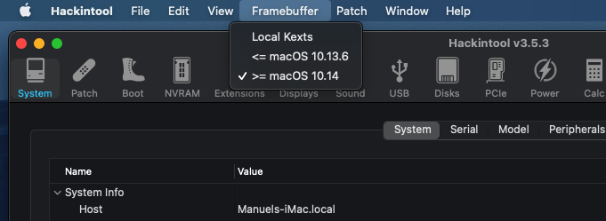
    * In **Patch** menu option check `Apply Current Patches`.

        In **System Configs** we must select the motherboard brand that we have, but in my case I couldn't find it, I tried selecting `Asus > TUF Z390-Pro Gaming [CFL]` which have a similar architecture as mines.

        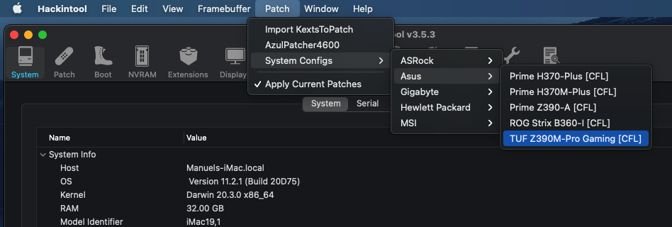

    * In `Patch` we must check the options as follows:

        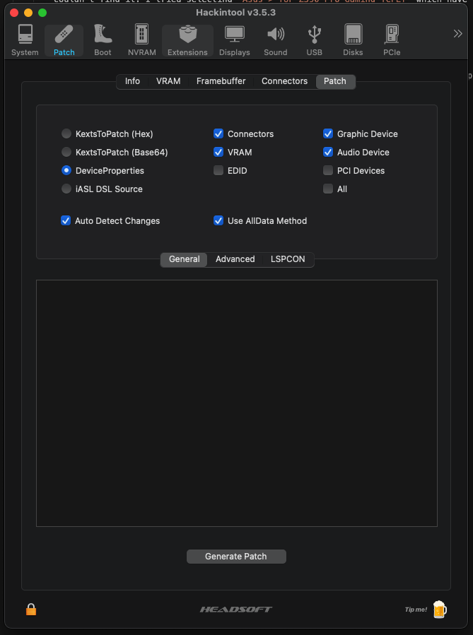
        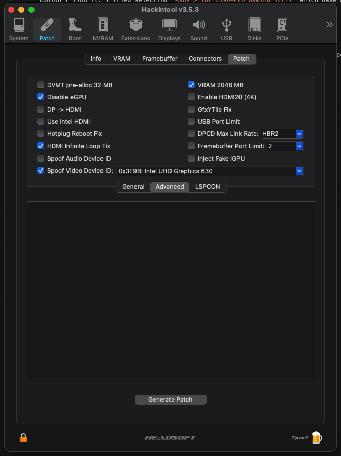
        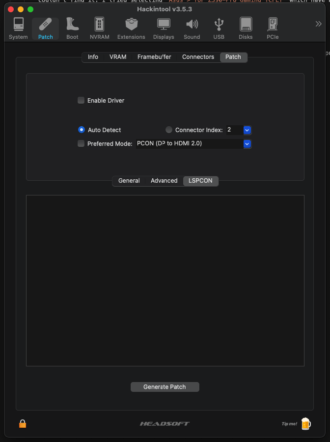

        After that, restart the Mac.
    * Once you restarted the Mac, you might see your seconday monitor enabled using HDMI port.

        Open Hackintool and make sure that you can see this next:

        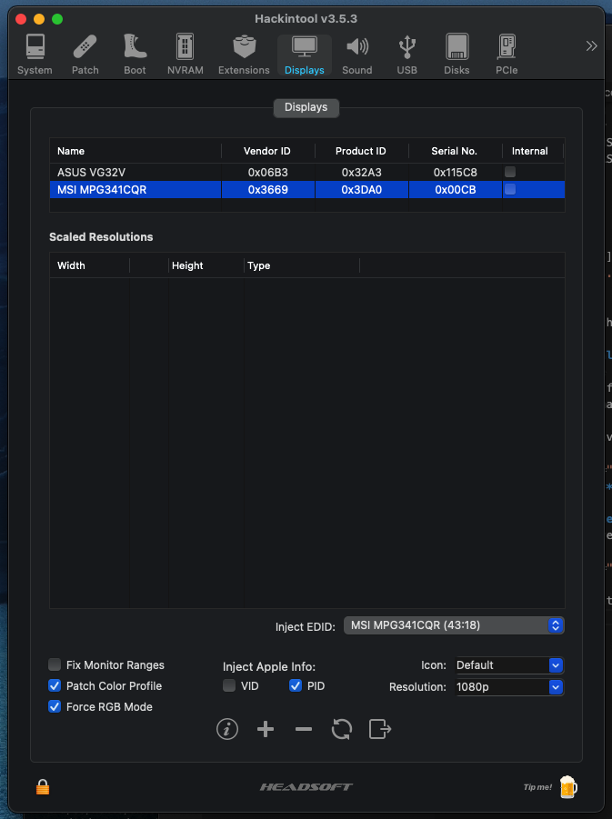
        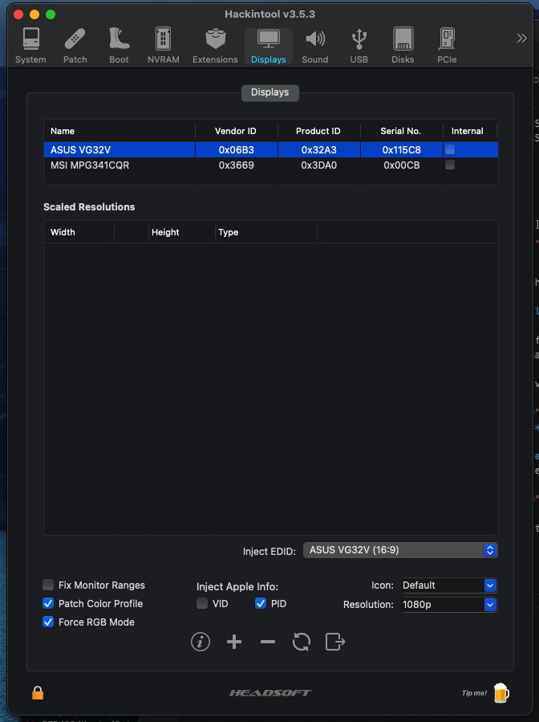
        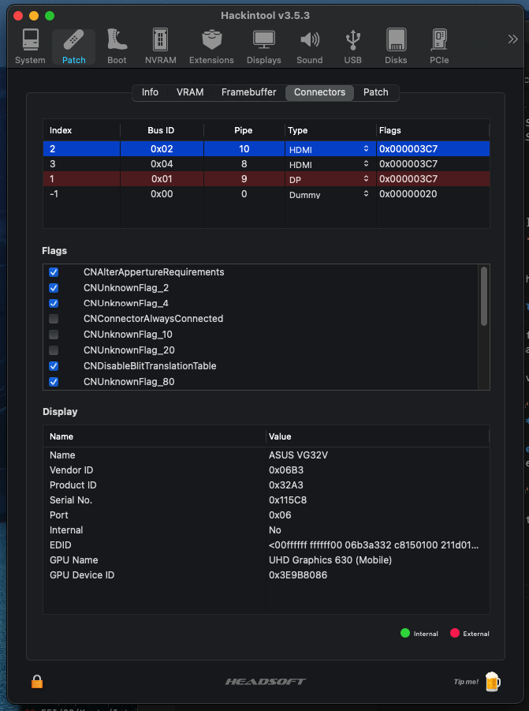
        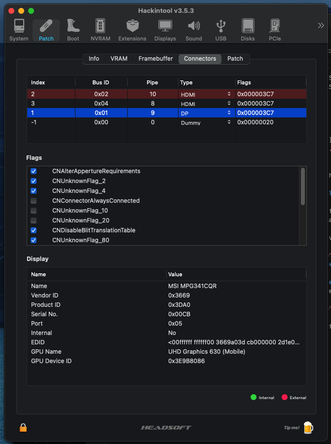
    * Display settings in Mac should look like this:

        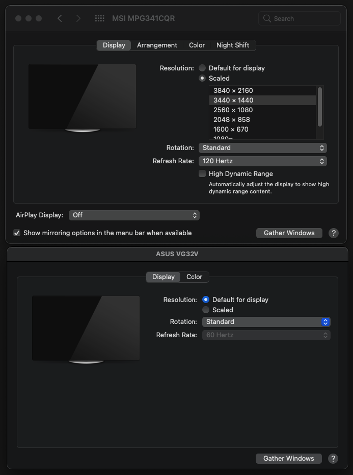
## Results
* Now, enjoy using Mac !

    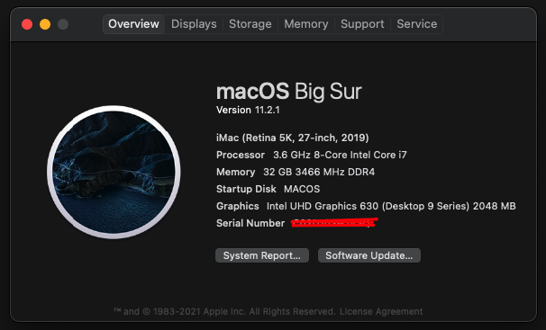

## Adding MacOS to GRUB
* In case you have a Linux distribution installed, you might want to add the MacOS boot into
the GRUB list. In order to make it easy you can install Grub Customizer, follow this [link](https://vitux.com/how-to-install-grub-customizer-on-ubuntu/) for Ubuntu installation.

* Once Grub Customizer was installed, you'll need to create a new **menuentry** and then we need to identify the UUID for the Mac's EFI partition, for that we can use Gparted to check that information as follows:

    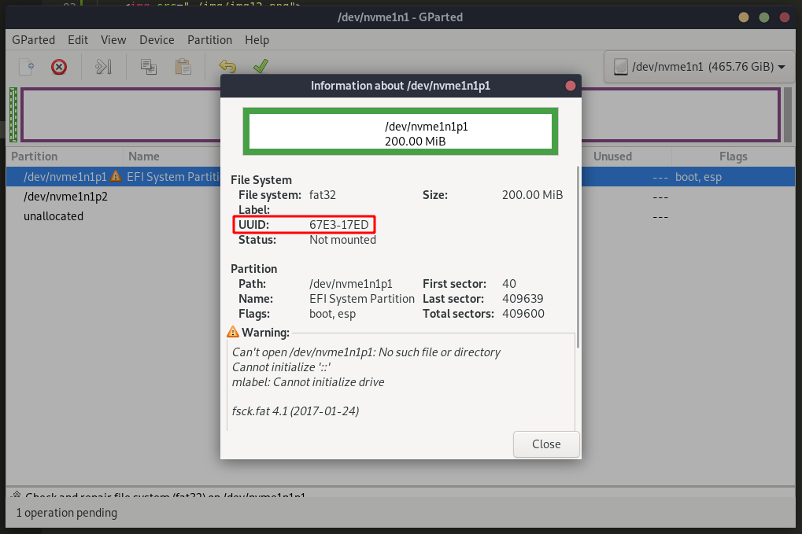

* Now we need to use this script for that new menuentry:
    ```
    insmod part_gpt
    insmod fat
    insmod search_fs_uui
    insmod chain
    search --fs-uuid --set=root MAC-UUID-EFI-PARTITION-HERE
    chainloader /EFI/BOOT/BOOTx64.efi
    ```

    The result will be like:

    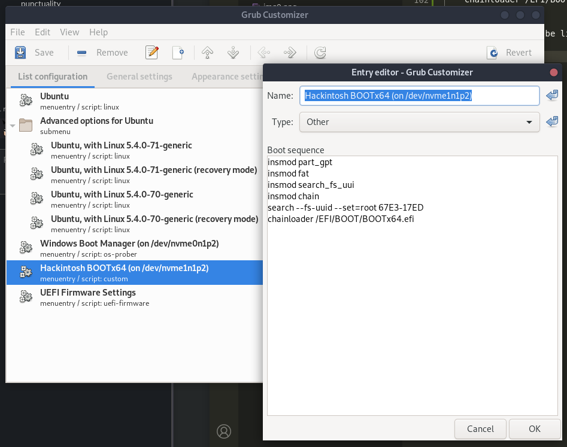

    Finally save all, and restart in order to see the menuentry for MacOS.